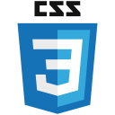

<!--
**devlower/devlower** is a ✨ _special_ ✨ repository because its `README.md` (this file) appears on your GitHub profile.

Here are some ideas to get you started:

- 🔭 I’m currently working as an intern in RPA development.
- 🌱 I’m currently learning Python.
- 👯 I’m looking to collaborate on ...
- 🤔 I’m looking for help with ...
- 💬 Ask me about ...
- 📫 How to reach me: ...
- 😄 Pronouns: she/her.
- ⚡ Fun fact: ...
-->

  

  ## Greetings and Welcome to my Profile! 👋🏻

  - 💻 **Computer Science Student [6/8]** - [_PUC Minas_](https://www.pucpcaldas.br/)
  - 🌱 **Learning Web/Mobile development**
  -  🌟 **Aspirations:**
      - 🐍 Python development
      - 🔐 Cyber security
  - 😄 **Pronouns: she/her**

  

  

## Technologies

  
</spam>
<spam title="Python">
  
</spam>
<spam title="Kotlin">
  
</spam>
<spam title="HTML5">
  
</spam>
<spam title="CSS3">
  
</spam>
<spam>
  
</spam>
<spam title="Ubuntu">
  
</spam>
<spam title="MySQL">
  
</spam>

 

## Projects

 <strong>College</strong>

  - C Language:
    - [Walls linear load calculator](https://github.com/devlower/LAED-II_ProjetoFinal)
    - [Math Quiz](https://github.com/devlower/math_quiz)
  - Arduino:
    - [Binary counter](https://github.com/devlower/arduino/tree/main/binaryCounter)
    - [Potentiometer and buzzer](https://github.com/devlower/arduino/tree/main/potenciometroBuzzer)
    - [Ultrasonic sensor](https://github.com/devlower/arduino/tree/main/sensorUltrassonico)
    - [Servo motor](https://github.com/devlower/arduino/tree/main/servomotor)
  - Articles:
    - [Data security and privacy for RFID and NFC biochip implants](https://github.com/devlower/articles/blob/main/Data%20security%20and%20privacy%20for%20RFID%20and%20NFC%20biochip%20implants.pdf)
  - C++ | OpenGL:
    - [TicTacToe](https://github.com/devlower/ticTacToe) 
  - Kotlin:
    - [Vaaz MVP](https://github.com/devlower/vaaz_mvp)
    - [Media rental management](https://github.com/devlower/trabalho-LP-POO)

    

<strong>Improving problem-solving skills</strong>

- Python:
    - [Leetcode problems](https://github.com/devlower/leetcode-solutions)

<strong>Learning and personal projects</strong>

- Kotlin | Android:
  - [QuizApp](https://github.com/devlower/QuizApp_Android)
  - 7minWorkOut - Soon
- Swift | iOS:
  - Pokédex - Soon
- React-Native:
  - [Habits (NLW-Setup-Ignite)](https://github.com/devlower/nlw_setup/tree/main/mobile)
- **Web:**
  - HTML5 | CSS3 | Javascript
    - [Habits (NLW-Setup-Explorer)](https://github.com/devlower/nlw_setup)
  - Typescript | React | Node.js
    - [Habits (NLW-Setup-Ignite)](https://github.com/devlower/nlw_setup)

  

  

    <a href="https://github.com/devlower">
    
    
  

  
  ##
  

 

